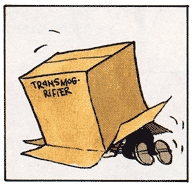

# emoji-transmogrifier [![NPM version][npm-image]][npm-url] [![Build Status][travis-image]][travis-url] [![Dependency Status][daviddm-image]][daviddm-url] [![Coverage percentage][coveralls-image]][coveralls-url]
> A handy little library (written as a Node.js module) for converting emoji short codes into HTML image tags. This is mostly a project to force myself to go through all the steps of creating a Node module.

## Transmogrifier
[](http://www.calvinandhobbes.com/)

## Installation

#### Globally
```sh
$ npm install -g emoji-transmogrifier
```

#### Locally
```sh
$ npm install emoji-transmogrifier
```

## Usage

Using the module is currently available from the command line as a brief utility to autmoate the conversion of the short code strings in markdown or html files and for traditional Node module consumption (aka- via a `require()` statement).

#### CLI Conversion Utility
```sh
emoji-transmogrifier -d <directory/> -t [md|markdown|html|htm]
```

#### Server Module
```js
var transmogrifier = require('emoji-transmogrifier');

var beerEmojiUrl = transmogrifier.getImage('beer');
console.log('the url of the GitHub emoji image for beer is: '+beerEmojiUrl);

var beerUniStr = transmogrifier.getUnicode('beer');
console.log('the unicode string for beer is: '+beerUniStr);
```


## History

This project was born from the need I had to convert the emoji short codes, a la `:smile:`, to an HTML image tag, for use with a book I'm writing with [gitbook](https://github.com/GitbookIO/gitbook). The web static version generated by gitbook was fine with some scripts I had injected to handle them, but ran into issues when generating the `pdf`, `mobi`, or `epub` versions of the book, yielding the original short code text. This project is the next evolutionary version of the script I created to perform the conversion.

## RegEx Pattern
At the heard of this task is a [regular expression](https://developer.mozilla.org/en-US/docs/Web/JavaScript/Guide/Regular_Expressions) that performs the matching of the short code which is to be replaced.

The RegEx pattern I sttled on can be viewed and tested against the known emoji short codes by viewing the pattern here:
https://regex101.com/r/hI5qF5/1

The pattern itself:

```js
/(\:(\w|\+|\-)+\:)(?=\s|[\!\.\?]|$)/gim
```

## Contributing
You may contribute by submitting [a Pull Request](https://help.github.com/articles/proposing-changes-to-a-project-with-pull-requests/) to this repository.

1. Fork it!
2. Create your feature branch: `git checkout -b my-new-feature`
3. Commit your changes: `git commit -am 'Add some feature'`
4. Push to the branch: `git push origin my-new-feature`
5. Submit a pull request :D

## License

MIT © [Eric McCormick](https://github.com/edm00se)


[npm-image]: https://badge.fury.io/js/emoji-transmogrifier.svg
[npm-url]: https://npmjs.org/package/emoji-transmogrifier
[travis-image]: https://travis-ci.org/edm00se/emoji-transmogrifier.svg?branch=master
[travis-url]: https://travis-ci.org/edm00se/emoji-transmogrifier
[daviddm-image]: https://david-dm.org/edm00se/emoji-transmogrifier.svg?theme=shields.io
[daviddm-url]: https://david-dm.org/edm00se/emoji-transmogrifier
[coveralls-image]: https://coveralls.io/repos/edm00se/emoji-transmogrifier/badge.svg
[coveralls-url]: https://coveralls.io/r/edm00se/emoji-transmogrifier
